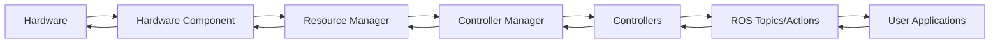

# ROS2 Control: Comprehensive Implementation Guide

*A practical guide to building robust robotic control systems with ROS2 Control framework*

## Table of Contents
1. [Introduction](#introduction)
2. [Architecture Overview](#architecture-overview)
3. [Component Types and Selection](#component-types-and-selection)
4. [Controller Types and Patterns](#controller-types-and-patterns)
5. [Minimal Viable Implementation](#minimal-viable-implementation)
6. [Common Pitfalls and Solutions](#common-pitfalls-and-solutions)
7. [Best Practices](#best-practices)
8. [Controller Chaining](#controller-chaining)
9. [Troubleshooting Guide](#troubleshooting-guide)
10. [Advanced Topics](#advanced-topics)
11. [Resources and References](#resources-and-references)

---

## Introduction

ROS2 Control is a real-time control framework designed for robotic applications. Based on our extensive experience implementing controllers (including complex admittance controllers), this guide provides practical insights into building robust, production-ready control systems.

### Why ROS2 Control?

- **Standardized Interface**: Unified approach to hardware abstraction
- **Real-time Capabilities**: Designed for real-time control loops
- **Modularity**: Pluggable architecture for hardware and controllers
- **Lifecycle Management**: Proper state management for safety-critical systems
- **Community Support**: Extensive ecosystem of controllers and hardware interfaces

### Key Concepts

```
Hardware ← Resource Manager ← Controller Manager ← Controllers ← User Interface
```

---

## Architecture Overview

### Core Components

#### 1. **Controller Manager (CM)**
- **Role**: Central coordinator and entry point
- **Responsibilities**:
  - Manages controller lifecycle
  - Handles interface allocation
  - Executes control loop
  - Provides ROS services for user interaction

#### 2. **Resource Manager (RM)**
- **Role**: Hardware abstraction layer
- **Responsibilities**:
  - Loads hardware components via pluginlib
  - Manages state and command interfaces
  - Handles hardware communication

#### 3. **Hardware Components**
- **Role**: Physical hardware interface
- **Types**: System, Actuator, Sensor
- **Responsibilities**:
  - Abstract hardware communication
  - Provide state and command interfaces

#### 4. **Controllers**
- **Role**: Control logic implementation
- **Types**: Standard, Chainable
- **Responsibilities**:
  - Implement control algorithms
  - Manage interface claims
  - Handle lifecycle transitions

### Data Flow



---

## Component Types and Selection

### System Components
**Use When**: Multi-DOF robots with centralized communication

```xml
<ros2_control name="RobotSystem" type="system">
  <hardware>
    <plugin>my_robot_hardware/MyRobotHardware</plugin>
    <param name="device_name">/dev/ttyUSB0</param>
  </hardware>
  <joint name="joint1">
    <command_interface name="position"/>
    <state_interface name="position"/>
    <state_interface name="velocity"/>
  </joint>
</ros2_control>
```

**Examples**:
- Industrial robot arms (UR, KUKA)
- Mobile robot bases
- Humanoid robots

### Actuator Components
**Use When**: Individual actuators with independent communication

```xml
<ros2_control name="WheelActuator" type="actuator">
  <hardware>
    <plugin>my_actuators/MotorDriver</plugin>
    <param name="can_id">1</param>
  </hardware>
  <joint name="wheel_joint">
    <command_interface name="velocity"/>
    <state_interface name="velocity"/>
    <state_interface name="position"/>
  </joint>
</ros2_control>
```

**Examples**:
- Individual motors with CAN communication
- Servo controllers
- Pneumatic actuators

### Sensor Components
**Use When**: Standalone sensors providing only state information

```xml
<ros2_control name="ForceSensor" type="sensor">
  <hardware>
    <plugin>my_sensors/FTSensorHardware</plugin>
    <param name="device_port">/dev/ttyUSB1</param>
  </hardware>
  <sensor name="tcp_fts_sensor">
    <state_interface name="force.x"/>
    <state_interface name="force.y"/>
    <state_interface name="force.z"/>
    <state_interface name="torque.x"/>
    <state_interface name="torque.y"/>
    <state_interface name="torque.z"/>
  </sensor>
</ros2_control>
```

**Examples**:
- Force/torque sensors
- IMU sensors
- Encoders

---

## Controller Types and Patterns

### Standard Controllers
**Purpose**: Direct hardware control

```cpp
class MyController : public controller_interface::ControllerInterface
{
public:
  controller_interface::InterfaceConfiguration command_interface_configuration() const override
  {
    controller_interface::InterfaceConfiguration config;
    config.type = controller_interface::interface_configuration_type::INDIVIDUAL;
    
    // Claim hardware interfaces directly
    for (const auto & joint : params_.joints) {
      config.names.push_back(joint + "/position");
    }
    return config;
  }
  
  controller_interface::return_type update(
    const rclcpp::Time & time, const rclcpp::Duration & period) override
  {
    // Control logic here
    for (size_t i = 0; i < command_interfaces_.size(); ++i) {
      command_interfaces_[i].set_value(computed_command[i]);
    }
    return controller_interface::return_type::OK;
  }
};
```

### Chainable Controllers
**Purpose**: Export reference interfaces for other controllers

```cpp
class MyChainableController : public controller_interface::ChainableControllerInterface
{
public:
  std::vector<hardware_interface::CommandInterface> on_export_reference_interfaces() override
  {
    std::vector<hardware_interface::CommandInterface> reference_interfaces;
    
    // Export reference interfaces for chaining
    for (size_t i = 0; i < params_.joints.size(); ++i) {
      reference_interfaces.emplace_back(
        get_node()->get_name(), 
        params_.joints[i] + "/position", 
        &reference_interfaces_[i]
      );
    }
    return reference_interfaces;
  }
};
```

### Controller Selection Matrix

| Use Case | Controller Type | Claims | Exports | Example |
|----------|----------------|---------|---------|---------|
| Direct robot control | Standard | Hardware interfaces | Nothing | joint_trajectory_controller |
| Preprocessing/filtering | Chainable | Hardware interfaces | Reference interfaces | admittance_controller |
| High-level planning | Standard | Reference interfaces | Nothing | planning_controller |

---

## Minimal Viable Implementation

### Step 1: Hardware Component

```cpp
#include "hardware_interface/system_interface.hpp"

class MinimalRobotHardware : public hardware_interface::SystemInterface
{
public:
  hardware_interface::CallbackReturn on_init(const hardware_interface::HardwareInfo & info) override
  {
    if (hardware_interface::SystemInterface::on_init(info) != CallbackReturn::SUCCESS) {
      return CallbackReturn::ERROR;
    }
    
    // Initialize hardware connections
    joint_positions_.resize(info_.joints.size(), 0.0);
    joint_velocities_.resize(info_.joints.size(), 0.0);
    joint_commands_.resize(info_.joints.size(), 0.0);
    
    return CallbackReturn::SUCCESS;
  }
  
  std::vector<hardware_interface::StateInterface> export_state_interfaces() override
  {
    std::vector<hardware_interface::StateInterface> state_interfaces;
    
    for (size_t i = 0; i < info_.joints.size(); ++i) {
      state_interfaces.emplace_back(
        info_.joints[i].name, "position", &joint_positions_[i]);
      state_interfaces.emplace_back(
        info_.joints[i].name, "velocity", &joint_velocities_[i]);
    }
    
    return state_interfaces;
  }
  
  std::vector<hardware_interface::CommandInterface> export_command_interfaces() override
  {
    std::vector<hardware_interface::CommandInterface> command_interfaces;
    
    for (size_t i = 0; i < info_.joints.size(); ++i) {
      command_interfaces.emplace_back(
        info_.joints[i].name, "position", &joint_commands_[i]);
    }
    
    return command_interfaces;
  }
  
  hardware_interface::return_type read(const rclcpp::Time & time, const rclcpp::Duration & period) override
  {
    // Read from actual hardware
    // Update joint_positions_ and joint_velocities_
    return hardware_interface::return_type::OK;
  }
  
  hardware_interface::return_type write(const rclcpp::Time & time, const rclcpp::Duration & period) override
  {
    // Write joint_commands_ to actual hardware
    return hardware_interface::return_type::OK;
  }

private:
  std::vector<double> joint_positions_;
  std::vector<double> joint_velocities_;
  std::vector<double> joint_commands_;
};
```

### Step 2: URDF Description

```xml
<robot name="minimal_robot">
  <ros2_control name="MinimalRobotHardware" type="system">
    <hardware>
      <plugin>minimal_robot_hardware/MinimalRobotHardware</plugin>
      <param name="device_port">/dev/ttyUSB0</param>
      <param name="baud_rate">115200</param>
    </hardware>
    
    <joint name="joint1">
      <command_interface name="position">
        <param name="min">-3.14</param>
        <param name="max">3.14</param>
      </command_interface>
      <state_interface name="position"/>
      <state_interface name="velocity"/>
    </joint>
    
    <joint name="joint2">
      <command_interface name="position">
        <param name="min">-1.57</param>
        <param name="max">1.57</param>
      </command_interface>
      <state_interface name="position"/>
      <state_interface name="velocity"/>
    </joint>
  </ros2_control>
</robot>
```

### Step 3: Controller Configuration

```yaml
controller_manager:
  ros__parameters:
    update_rate: 100  # Hz
    
    joint_state_broadcaster:
      type: joint_state_broadcaster/JointStateBroadcaster
      
    position_controller:
      type: position_controllers/JointGroupPositionController

position_controller:
  ros__parameters:
    joints:
      - joint1
      - joint2
    command_interfaces:
      - position
    state_interfaces:
      - position
      - velocity
```

### Step 4: Launch File

```python
from launch import LaunchDescription
from launch_ros.actions import Node
from launch.actions import DeclareLaunchArgument
from launch.substitutions import LaunchConfiguration

def generate_launch_description():
    return LaunchDescription([
        DeclareLaunchArgument('use_sim_time', default_value='false'),
        
        Node(
            package='controller_manager',
            executable='ros2_control_node',
            parameters=[
                {'robot_description': robot_description},
                {'use_sim_time': LaunchConfiguration('use_sim_time')},
                config_file
            ],
            output='screen'
        ),
        
        Node(
            package='controller_manager',
            executable='spawner',
            arguments=['joint_state_broadcaster', '--controller-manager', '/controller_manager'],
            output='screen'
        ),
        
        Node(
            package='controller_manager',
            executable='spawner',
            arguments=['position_controller', '--controller-manager', '/controller_manager'],
            output='screen'
        )
    ])
```

---

## Common Pitfalls and Solutions

*Based on real-world implementation experience*

### 1. Interface Claiming Conflicts

**Problem**: Multiple controllers trying to claim the same hardware interface
```
[ERROR] Resource conflict for controller 'my_controller'. 
Command interface 'joint1/position' is already claimed.
```

**Root Cause**: ROS2 Control enforces exclusive interface ownership

**Solutions**:
```bash
# Check active controllers
ros2 control list_controllers

# Stop conflicting controller
ros2 control switch_controllers --stop trajectory_controller --start my_controller

# Or use controller chaining if appropriate
```

### 2. ChainableController Misunderstanding

**Problem**: Trying to claim reference interfaces from non-chainable controllers
```
[WARN] No state/reference interface from controller : 
'joint_trajectory_controller/joint1/position' exist, 
since the following controller with name 'joint_trajectory_controller' is not chainable.
```

**Root Cause**: Not all controllers export reference interfaces

**Solution**:
```cpp
// Check if controller is chainable first
// Most standard controllers (joint_trajectory_controller) are NOT chainable
// Use hardware interfaces for non-chainable controllers

controller_interface::InterfaceConfiguration command_interface_configuration() const override
{
  controller_interface::InterfaceConfiguration config;
  config.type = controller_interface::interface_configuration_type::INDIVIDUAL;
  
  // For non-chainable controllers, claim hardware interfaces
  for (const auto & joint : params_.joints) {
    config.names.push_back(joint + "/position");  // Hardware interface
  }
  
  return config;
}
```

### 3. Transform Handling Segfaults

**Problem**: Segmentation faults during controller lifecycle transitions
```
#0 Object "libtf2_ros.so", at 0x7fa9095bfcdf, in tf2_ros::Buffer::timerCallback
```

**Root Cause**: tf2_ros::Buffer::canTransform() with timeout creates timers that persist across lifecycle changes

**Solution**:
```cpp
// Use canTransform WITHOUT timeout in controller callbacks
bool transform_available = tf_buffer_->canTransform(
  target_frame, source_frame, 
  tf2::TimePointZero,  // No timeout - non-blocking
  &error
);

// Use timeout only in non-lifecycle contexts with proper cleanup
```

### 4. Parameter Loading Timing

**Problem**: Parameters not available during interface configuration
```cpp
// WRONG - params_ not loaded yet
controller_interface::InterfaceConfiguration command_interface_configuration() const override
{
  // params_ is empty here!
  for (const auto & joint : params_.joints) {
    config.names.push_back(joint + "/position");
  }
}
```

**Solution**:
```cpp
controller_interface::CallbackReturn on_init() override
{
  // Load parameters FIRST
  param_listener_ = std::make_shared<ParamListener>(get_node());
  params_ = param_listener_->get_params();
  
  // THEN initialize other components
  tf_buffer_ = std::make_unique<tf2_ros::Buffer>(get_node()->get_clock());
  
  return CallbackReturn::SUCCESS;
}
```

### 5. Hardware Interface Lifecycle Mismatch

**Problem**: Accessing interfaces before they're available
```cpp
// WRONG - interfaces not available in on_configure
controller_interface::CallbackReturn on_configure(...) override
{
  // command_interfaces_ is empty here!
  for (auto& interface : command_interfaces_) {
    // This will fail
  }
}
```

**Solution**:
```cpp
controller_interface::CallbackReturn on_activate(...) override
{
  // Interfaces are available in on_activate
  for (size_t i = 0; i < command_interfaces_.size(); ++i) {
    // Safe to access here
    joint_commands_[i] = command_interfaces_[i].get_value();
  }
  
  return CallbackReturn::SUCCESS;
}
```

---

## Best Practices

### 1. Lifecycle Management

```cpp
class WellDesignedController : public controller_interface::ControllerInterface
{
public:
  // on_init: Load parameters, create non-interface resources
  controller_interface::CallbackReturn on_init() override
  {
    param_listener_ = std::make_shared<ParamListener>(get_node());
    params_ = param_listener_->get_params();
    
    tf_buffer_ = std::make_unique<tf2_ros::Buffer>(get_node()->get_clock());
    tf_listener_ = std::make_unique<tf2_ros::TransformListener>(*tf_buffer_);
    
    return CallbackReturn::SUCCESS;
  }
  
  // on_configure: Setup publishers, subscribers, validate configuration
  controller_interface::CallbackReturn on_configure(...) override
  {
    cmd_publisher_ = get_node()->create_publisher<CommandMsg>("/cmd", 10);
    
    // Validate parameters
    if (params_.joints.empty()) {
      RCLCPP_ERROR(get_node()->get_logger(), "No joints specified");
      return CallbackReturn::ERROR;
    }
    
    return CallbackReturn::SUCCESS;
  }
  
  // on_activate: Initialize interface access, start control
  controller_interface::CallbackReturn on_activate(...) override
  {
    // Initialize from current state
    for (size_t i = 0; i < state_interfaces_.size(); ++i) {
      last_commands_[i] = state_interfaces_[i].get_value();
    }
    
    // Validate transforms are available
    if (!waitForTransforms()) {
      return CallbackReturn::FAILURE;
    }
    
    return CallbackReturn::SUCCESS;
  }
};
```

### 2. Error Handling and Safety

```cpp
controller_interface::return_type update(
  const rclcpp::Time & time, const rclcpp::Duration & period) override
{
  // Validate inputs
  if (period.seconds() <= 0 || period.seconds() > 0.1) {
    RCLCPP_WARN_THROTTLE(get_node()->get_logger(), *get_node()->get_clock(), 1000,
      "Invalid period: %f", period.seconds());
    return return_type::ERROR;
  }
  
  // Check interface validity
  for (const auto& interface : command_interfaces_) {
    if (!interface.get_value_ptr()) {
      RCLCPP_ERROR(get_node()->get_logger(), "Invalid command interface");
      return return_type::ERROR;
    }
  }
  
  // Implement safety limits
  for (size_t i = 0; i < computed_commands.size(); ++i) {
    computed_commands[i] = std::clamp(
      computed_commands[i], 
      params_.joint_limits[i].min, 
      params_.joint_limits[i].max
    );
  }
  
  // Apply commands
  for (size_t i = 0; i < command_interfaces_.size(); ++i) {
    command_interfaces_[i].set_value(computed_commands[i]);
  }
  
  return return_type::OK;
}
```

### 3. Real-time Considerations

```cpp
// Avoid dynamic allocation in update()
class RTSafeController : public controller_interface::ControllerInterface
{
private:
  // Pre-allocate all containers
  std::vector<double> joint_commands_;
  std::vector<double> joint_positions_;
  realtime_tools::RealtimeBuffer<CommandMsg> rt_command_buffer_;
  
public:
  controller_interface::return_type update(...) override
  {
    // Use pre-allocated memory
    CommandMsg* cmd = rt_command_buffer_.readFromRT();
    
    // Avoid:
    // - std::vector::push_back()
    // - new/delete
    // - std::cout (use RCLCPP_*_THROTTLE instead)
    // - mutex locks (use lock-free structures)
    
    return return_type::OK;
  }
};
```

### 4. Configuration Validation

```cpp
controller_interface::InterfaceConfiguration command_interface_configuration() const override
{
  controller_interface::InterfaceConfiguration config;
  config.type = controller_interface::interface_configuration_type::INDIVIDUAL;
  
  // Validate joint configuration
  if (params_.joints.empty()) {
    throw std::runtime_error("No joints configured");
  }
  
  // Build interface names
  for (const auto & joint : params_.joints) {
    for (const auto & interface : params_.command_interfaces) {
      config.names.push_back(joint + "/" + interface);
    }
  }
  
  RCLCPP_INFO(get_node()->get_logger(), 
    "Configured %zu command interfaces", config.names.size());
  
  return config;
}
```

---

## Controller Chaining

### When to Use Chaining

**Scenario**: You want to add preprocessing (e.g., admittance control) before trajectory execution

```
Force Sensor → Admittance Controller → Trajectory Controller → Hardware
```

### Implementation Pattern

#### Chainable Controller (Preprocessor)
```cpp
class AdmittanceController : public controller_interface::ChainableControllerInterface
{
public:
  // Claim hardware interfaces (for sensors)
  controller_interface::InterfaceConfiguration state_interface_configuration() const override
  {
    controller_interface::InterfaceConfiguration config;
    config.type = controller_interface::interface_configuration_type::INDIVIDUAL;
    
    // Claim F/T sensor interfaces
    for (const auto & axis : {"force.x", "force.y", "force.z", "torque.x", "torque.y", "torque.z"}) {
      config.names.push_back(params_.ft_sensor_name + "/" + axis);
    }
    
    return config;
  }
  
  // Export reference interfaces for downstream controller
  std::vector<hardware_interface::CommandInterface> on_export_reference_interfaces() override
  {
    std::vector<hardware_interface::CommandInterface> reference_interfaces;
    
    for (size_t i = 0; i < params_.joints.size(); ++i) {
      reference_interfaces.emplace_back(
        get_node()->get_name(), 
        params_.joints[i] + "/position", 
        &reference_positions_[i]
      );
    }
    
    return reference_interfaces;
  }
  
  controller_interface::return_type update_and_write_commands(...) override
  {
    // Read F/T sensor
    readForceTorque();
    
    // Compute admittance
    computeAdmittance();
    
    // Update reference interfaces (consumed by downstream controller)
    for (size_t i = 0; i < reference_positions_.size(); ++i) {
      reference_positions_[i] = computed_positions_[i];
    }
    
    return return_type::OK;
  }
};
```

#### Downstream Controller Configuration
```cpp
class TrajectoryController : public controller_interface::ControllerInterface
{
public:
  controller_interface::InterfaceConfiguration command_interface_configuration() const override
  {
    controller_interface::InterfaceConfiguration config;
    config.type = controller_interface::interface_configuration_type::INDIVIDUAL;
    
    // Claim reference interfaces from chainable controller
    for (const auto & joint : params_.joints) {
      config.names.push_back(params_.chainable_controller_name + "/" + joint + "/position");
    }
    
    return config;
  }
};
```

### Controller Chain Launch
```python
def generate_launch_description():
    return LaunchDescription([
        # 1. Start admittance controller (chainable)
        Node(
            package='controller_manager',
            executable='spawner',
            arguments=['admittance_controller', '--controller-manager', '/controller_manager'],
        ),
        
        # 2. Start trajectory controller (claims admittance references)
        Node(
            package='controller_manager',
            executable='spawner',
            arguments=['trajectory_controller', '--controller-manager', '/controller_manager'],
        )
    ])
```

---

## Troubleshooting Guide

### Diagnostic Commands

```bash
# List all controllers and their states
ros2 control list_controllers -v

# List all available interfaces
ros2 control list_hardware_interfaces

# Check controller configuration
ros2 param dump /controller_manager

# Monitor controller switching
ros2 service call /controller_manager/switch_controller controller_manager_msgs/srv/SwitchController

# Real-time monitoring
ros2 topic echo /dynamic_joint_states
```

### Common Error Patterns

| Error Message | Cause | Solution |
|---------------|-------|----------|
| `Resource conflict for controller` | Multiple controllers claiming same interface | Use controller switching |
| `Command interface 'X' does not exist` | Interface not available from hardware | Check URDF and hardware component |
| `Controller 'X' is not chainable` | Trying to claim reference interfaces from standard controller | Use hardware interfaces instead |
| `State interface index out of bounds` | Accessing interfaces before activation | Move interface access to on_activate() |
| `Failed to activate controller` | Configuration or dependency issue | Check logs and interface availability |

### Performance Debugging

```cpp
// Add timing measurements
class DebuggingController : public controller_interface::ControllerInterface
{
private:
  rclcpp::Time last_update_time_;
  std::chrono::steady_clock::time_point start_time_;
  
public:
  controller_interface::return_type update(...) override
  {
    start_time_ = std::chrono::steady_clock::now();
    
    // Your control logic here
    
    auto end_time = std::chrono::steady_clock::now();
    auto duration = std::chrono::duration_cast<std::chrono::microseconds>(end_time - start_time_);
    
    if (duration.count() > 1000) {  // > 1ms
      RCLCPP_WARN_THROTTLE(get_node()->get_logger(), *get_node()->get_clock(), 1000,
        "Update took %ld microseconds", duration.count());
    }
    
    return return_type::OK;
  }
};
```

---

## Advanced Topics

### Custom Hardware Components

```cpp
// Template for custom hardware component
class CustomHardware : public hardware_interface::SystemInterface
{
public:
  hardware_interface::CallbackReturn on_init(const hardware_interface::HardwareInfo & info) override
  {
    // Parse custom parameters
    for (const auto & param : info.hardware_parameters) {
      if (param.first == "custom_param") {
        custom_value_ = param.second;
      }
    }
    
    return CallbackReturn::SUCCESS;
  }
  
  hardware_interface::CallbackReturn on_configure(const rclcpp_lifecycle::State & previous_state) override
  {
    // Initialize hardware connection
    if (!connectToHardware()) {
      return CallbackReturn::ERROR;
    }
    
    return CallbackReturn::SUCCESS;
  }
  
  hardware_interface::return_type read(const rclcpp::Time & time, const rclcpp::Duration & period) override
  {
    // Implement hardware-specific reading
    return hardware_interface::return_type::OK;
  }
  
  hardware_interface::return_type write(const rclcpp::Time & time, const rclcpp::Duration & period) override
  {
    // Implement hardware-specific writing
    return hardware_interface::return_type::OK;
  }
};
```

### Plugin Export

```cpp
// plugin_export.cpp
#include "pluginlib/class_list_macros.hpp"
#include "my_controllers/my_controller.hpp"
#include "my_hardware/my_hardware.hpp"

PLUGINLIB_EXPORT_CLASS(
  my_controllers::MyController,
  controller_interface::ControllerInterface
)

PLUGINLIB_EXPORT_CLASS(
  my_hardware::MyHardware,
  hardware_interface::SystemInterface
)
```

```xml
<!-- my_controllers.xml -->
<library path="my_controllers">
  <class name="my_controllers/MyController" type="my_controllers::MyController" base_class_type="controller_interface::ControllerInterface">
    <description>Custom controller implementation</description>
  </class>
</library>
```

### Integration Testing

```python
#!/usr/bin/env python3
import pytest
import rclpy
from controller_manager_msgs.srv import SwitchController, ListControllers

class TestControllerIntegration:
    def test_controller_loading(self):
        # Test controller can be loaded
        response = self.controller_manager.call_service(
            '/controller_manager/list_controllers'
        )
        assert 'my_controller' in [c.name for c in response.controller]
    
    def test_controller_activation(self):
        # Test controller can be activated
        response = self.controller_manager.call_service(
            '/controller_manager/switch_controller',
            {'activate_controllers': ['my_controller']}
        )
        assert response.ok
    
    def test_interface_claims(self):
        # Test controller claims expected interfaces
        response = self.controller_manager.call_service(
            '/controller_manager/list_hardware_interfaces'
        )
        claimed_interfaces = [i.name for i in response.command_interfaces if i.is_claimed]
        expected_interfaces = ['joint1/position', 'joint2/position']
        assert all(iface in claimed_interfaces for iface in expected_interfaces)
```

---

## Performance Optimization

### Real-time Optimization

```cpp
// Optimize for real-time performance
class OptimizedController : public controller_interface::ControllerInterface
{
public:
  controller_interface::CallbackReturn on_configure(...) override
  {
    // Pre-allocate all memory
    joint_commands_.resize(params_.joints.size());
    pid_controllers_.resize(params_.joints.size());
    
    // Pre-compute constants
    dt_inverse_ = 1.0 / params_.update_rate;
    
    return CallbackReturn::SUCCESS;
  }
  
  controller_interface::return_type update(...) override
  {
    // Use const references to avoid copies
    const auto& joint_positions = getCurrentPositions();
    
    // Minimize system calls
    static size_t update_counter = 0;
    if (++update_counter % 100 == 0) {
      // Periodic maintenance tasks
    }
    
    // Use SIMD operations for vector math
    #pragma omp simd
    for (size_t i = 0; i < joint_commands_.size(); ++i) {
      joint_commands_[i] = computePID(i, joint_positions[i]);
    }
    
    return return_type::OK;
  }
};
```

### Memory Management

```cpp
// Avoid dynamic allocation in real-time context
class MemoryEfficientController : public controller_interface::ControllerInterface
{
private:
  // Use fixed-size containers
  std::array<double, MAX_JOINTS> joint_commands_;
  std::array<PIDController, MAX_JOINTS> pid_controllers_;
  
  // Use object pools for temporary objects
  ObjectPool<Trajectory> trajectory_pool_;
  
public:
  controller_interface::return_type update(...) override
  {
    // Reuse objects from pool
    auto trajectory = trajectory_pool_.acquire();
    
    // Use it...
    
    // Return to pool
    trajectory_pool_.release(std::move(trajectory));
    
    return return_type::OK;
  }
};
```

---

## Real-World Implementation Examples

### Case Study: Admittance Controller Implementation

Based on our experience implementing a force-compliant admittance controller, here are the key lessons learned:

#### Initial Architecture Mistake
```cpp
// WRONG: Tried to chain FROM non-chainable controller
controller_interface::InterfaceConfiguration command_interface_configuration() const override
{
  controller_interface::InterfaceConfiguration config;
  config.type = controller_interface::interface_configuration_type::INDIVIDUAL;
  
  // This fails because scaled_joint_trajectory_controller is NOT chainable
  for (const auto & joint : params_.joints) {
    config.names.push_back(params_.downstream_controller_name + "/" + joint + "/position");
  }
  
  return config;
}
```

#### Corrected Implementation
```cpp
// CORRECT: Claim hardware interfaces directly
controller_interface::InterfaceConfiguration command_interface_configuration() const override
{
  controller_interface::InterfaceConfiguration config;
  config.type = controller_interface::interface_configuration_type::INDIVIDUAL;
  
  // Claim hardware interfaces for exclusive control
  for (const auto & joint : params_.joints) {
    config.names.push_back(joint + "/position");
  }
  
  return config;
}
```

#### Transform Handling Solution
```cpp
// Safe transform checking without segfaults
bool AdmittanceController::waitForTransforms()
{
  // Use canTransform WITHOUT timeout to avoid timer issues
  std::string error;
  
  bool transforms_available = 
    tf_buffer_->canTransform(params_.base_link, params_.tip_link, 
                            tf2::TimePointZero, &error) &&
    tf_buffer_->canTransform(params_.base_link, params_.ft_frame, 
                            tf2::TimePointZero, &error);
  
  if (!transforms_available) {
    RCLCPP_WARN(get_node()->get_logger(), 
      "Required transforms not available: %s", error.c_str());
    return false;
  }
  
  return true;
}
```

### Case Study: Parameter Loading Timing

#### The Problem
```cpp
// Parameters not available during interface configuration
controller_interface::InterfaceConfiguration AdmittanceController::state_interface_configuration() const
{
  // params_.ft_sensor_name is empty here!
  if (!params_.ft_sensor_name.empty()) {
    // This condition always fails
    for (const auto & axis : ft_axes) {
      config.names.push_back(params_.ft_sensor_name + "/" + axis);
    }
  }
}
```

#### The Solution
```cpp
controller_interface::CallbackReturn on_init() override
{
  // Load parameters FIRST, before any other initialization
  try {
    param_listener_ = std::make_shared<ur_admittance_controller::ParamListener>(get_node());
    params_ = param_listener_->get_params();
    
    RCLCPP_INFO(get_node()->get_logger(), 
      "Loaded parameters - ft_sensor: %s, base_link: %s", 
      params_.ft_sensor_name.c_str(), params_.base_link.c_str());
      
  } catch (const std::exception & e) {
    RCLCPP_ERROR(get_node()->get_logger(), "Failed to load parameters: %s", e.what());
    return CallbackReturn::ERROR;
  }
  
  // NOW initialize tf_buffer and other components
  tf_buffer_ = std::make_unique<tf2_ros::Buffer>(get_node()->get_clock());
  tf_listener_ = std::make_unique<tf2_ros::TransformListener>(*tf_buffer_);
  
  return CallbackReturn::SUCCESS;
}
```

### Case Study: Controller Switching for Safety

When you need to keep a safety controller active (like trajectory controller), implement an adapter pattern:

```python
#!/usr/bin/env python3
"""
Admittance Adapter Node - Provides admittance control while keeping 
trajectory controller active for safety
"""

import rclpy
from rclpy.node import Node
from geometry_msgs.msg import WrenchStamped
from sensor_msgs.msg import JointState
from trajectory_msgs.msg import JointTrajectory, JointTrajectoryPoint
from rclpy.action import ActionClient
from control_msgs.action import FollowJointTrajectory

class AdmittanceAdapter(Node):
    def __init__(self):
        super().__init__('admittance_adapter')
        
        # Subscribe to F/T sensor
        self.ft_sub = self.create_subscription(
            WrenchStamped, 
            '/wrist_ft_sensor', 
            self.ft_callback, 
            10
        )
        
        # Subscribe to joint states
        self.joint_sub = self.create_subscription(
            JointState,
            '/joint_states',
            self.joint_callback,
            10
        )
        
        # Action client for trajectory controller
        self.trajectory_client = ActionClient(
            self, 
            FollowJointTrajectory, 
            '/scaled_joint_trajectory_controller/follow_joint_trajectory'
        )
        
        # Admittance parameters
        self.mass = [8.0, 8.0, 8.0, 0.8, 0.8, 0.8]
        self.damping = [50.0, 50.0, 50.0, 5.0, 5.0, 5.0]
        self.dt = 0.01  # 100Hz
        
        # State variables
        self.current_positions = None
        self.desired_positions = None
        self.velocity = [0.0] * 6
        
        # Control timer
        self.control_timer = self.create_timer(self.dt, self.control_loop)
        
    def ft_callback(self, msg):
        if self.current_positions is None:
            return
            
        # Extract forces and torques
        forces = [msg.wrench.force.x, msg.wrench.force.y, msg.wrench.force.z,
                 msg.wrench.torque.x, msg.wrench.torque.y, msg.wrench.torque.z]
        
        # Compute admittance control
        for i in range(6):
            # Simple admittance law: F = M*a + D*v
            acceleration = (forces[i] - self.damping[i] * self.velocity[i]) / self.mass[i]
            self.velocity[i] += acceleration * self.dt
            
            # Update desired position
            if self.desired_positions is not None:
                self.desired_positions[i] += self.velocity[i] * self.dt
    
    def joint_callback(self, msg):
        self.current_positions = list(msg.position)
        if self.desired_positions is None:
            self.desired_positions = list(msg.position)
    
    def control_loop(self):
        if self.desired_positions is None:
            return
            
        # Send new trajectory goal
        goal = FollowJointTrajectory.Goal()
        goal.trajectory.joint_names = [
            'shoulder_pan_joint', 'shoulder_lift_joint', 'elbow_joint',
            'wrist_1_joint', 'wrist_2_joint', 'wrist_3_joint'
        ]
        
        point = JointTrajectoryPoint()
        point.positions = self.desired_positions
        point.time_from_start.sec = 0
        point.time_from_start.nanosec = int(self.dt * 1e9)
        
        goal.trajectory.points = [point]
        
        # Send goal asynchronously
        if self.trajectory_client.server_is_ready():
            self.trajectory_client.send_goal_async(goal)

def main():
    rclpy.init()
    node = AdmittanceAdapter()
    try:
        rclpy.spin(node)
    except KeyboardInterrupt:
        pass
    finally:
        node.destroy_node()
        rclpy.shutdown()

if __name__ == '__main__':
    main()
```

---

## Debugging and Diagnostics

### Essential Diagnostic Commands

```bash
# Complete system health check
ros2_control_diagnostics() {
    echo "=== Controller Manager Status ==="
    ros2 control list_controllers -v
    
    echo "=== Hardware Interfaces ==="
    ros2 control list_hardware_interfaces
    
    echo "=== Available Controllers ==="
    ros2 pkg list | grep controllers
    
    echo "=== Controller Manager Parameters ==="
    ros2 param dump /controller_manager --print
    
    echo "=== Active Topics ==="
    ros2 topic list | grep -E "(joint|control)"
    
    echo "=== Transform Tree ==="
    ros2 run tf2_tools view_frames
}
```

### Error Pattern Recognition

#### Pattern 1: Segmentation Fault in TF
```
Stack trace: #0 Object "libtf2_ros.so", at 0x..., in tf2_ros::Buffer::timerCallback
```
**Cause**: Using `canTransform()` with timeout during lifecycle transitions
**Fix**: Use `tf2::TimePointZero` instead of timeout duration

#### Pattern 2: Interface Not Found
```
[ERROR] Can't activate controller 'my_controller': Command interface with 'joint1/position' does not exist
```
**Diagnosis Steps**:
```bash
# 1. Check hardware interfaces
ros2 control list_hardware_interfaces

# 2. Check URDF
ros2 param get /robot_state_publisher robot_description

# 3. Check hardware component status
ros2 lifecycle get /hardware_component_name
```

#### Pattern 3: Resource Conflict
```
[ERROR] Resource conflict for controller 'controller_a'. Command interface 'joint1/position' is already claimed.
```
**Diagnosis**:
```bash
# Find conflicting controller
ros2 control list_controllers -v | grep -A 5 -B 5 "joint1/position"

# Stop conflicting controller
ros2 control switch_controllers --stop conflicting_controller --start my_controller
```

### Real-time Performance Monitoring

```cpp
// Add to your controller for performance monitoring
class PerformanceMonitor
{
private:
    std::chrono::steady_clock::time_point last_update_;
    std::array<double, 100> update_times_;
    size_t time_index_ = 0;
    bool monitoring_enabled_ = true;
    
public:
    void startUpdate() 
    {
        if (!monitoring_enabled_) return;
        last_update_ = std::chrono::steady_clock::now();
    }
    
    void endUpdate() 
    {
        if (!monitoring_enabled_) return;
        
        auto now = std::chrono::steady_clock::now();
        auto duration = std::chrono::duration_cast<std::chrono::microseconds>(now - last_update_);
        
        update_times_[time_index_] = duration.count();
        time_index_ = (time_index_ + 1) % update_times_.size();
        
        // Log slow updates
        if (duration.count() > 1000) {  // > 1ms
            RCLCPP_WARN_THROTTLE(logger_, clock_, 1000,
                "Slow update: %ld μs", duration.count());
        }
    }
    
    void logStatistics()
    {
        double avg = std::accumulate(update_times_.begin(), update_times_.end(), 0.0) / update_times_.size();
        auto max_it = std::max_element(update_times_.begin(), update_times_.end());
        
        RCLCPP_INFO(logger_, "Update times - Avg: %.1f μs, Max: %.1f μs", avg, *max_it);
    }
};
```

---

## Deployment Checklist

### Pre-deployment Validation

- [ ] **Hardware Interface Testing**
  ```bash
  # Test hardware component lifecycle
  ros2 lifecycle set /hardware_component configure
  ros2 lifecycle set /hardware_component activate
  ```

- [ ] **Controller Loading**
  ```bash
  # Verify controller can be loaded
  ros2 control load_controller my_controller
  ros2 control list_controllers
  ```

- [ ] **Interface Claiming**
  ```bash
  # Verify no interface conflicts
  ros2 control list_hardware_interfaces | grep claimed
  ```

- [ ] **Parameter Validation**
  ```bash
  # Check all required parameters are set
  ros2 param dump /my_controller --print
  ```

- [ ] **Transform Tree**
  ```bash
  # Verify complete transform tree
  ros2 run tf2_tools view_frames
  ```

- [ ] **Real-time Performance**
  ```bash
  # Monitor update frequency
  ros2 topic hz /joint_states
  ```

### Production Deployment

```yaml
# production_config.yaml
controller_manager:
  ros__parameters:
    update_rate: 1000  # High-frequency for production
    
    # Enable diagnostics
    enable_diagnostics: true
    diagnostics_publish_rate: 10.0
    
    # Strict timing
    strict_timing: true
    max_update_time_ms: 1.0

my_controller:
  ros__parameters:
    # Production safety limits
    joint_limits:
      velocity: [1.0, 1.0, 1.0, 2.0, 2.0, 2.0]  # rad/s
      acceleration: [2.0, 2.0, 2.0, 4.0, 4.0, 4.0]  # rad/s²
    
    # Error handling
    max_tracking_error: 0.05  # rad
    emergency_stop_enabled: true
    
    # Monitoring
    publish_state: true
    log_level: "WARN"  # Reduce log spam in production
```

---

## Migration Guide

### From ROS1 to ROS2 Control

#### ROS1 Controller
```cpp
// ROS1 style
class OldController : public controller_interface::Controller<hardware_interface::PositionJointInterface>
{
  bool init(hardware_interface::PositionJointInterface* hw, ros::NodeHandle& nh) override
  {
    // ROS1 initialization
  }
  
  void update(const ros::Time& time, const ros::Duration& period) override
  {
    // Control logic
  }
};
```

#### ROS2 Migration
```cpp
// ROS2 style
class NewController : public controller_interface::ControllerInterface
{
public:
  controller_interface::InterfaceConfiguration command_interface_configuration() const override
  {
    // Define required interfaces
  }
  
  controller_interface::CallbackReturn on_init() override
  {
    // ROS2 initialization with lifecycle
  }
  
  controller_interface::return_type update(
    const rclcpp::Time & time, const rclcpp::Duration & period) override
  {
    // Control logic with return codes
  }
};
```

#### Key Differences
- **Lifecycle Management**: Explicit state management
- **Interface Configuration**: Declarative interface claiming
- **Error Handling**: Return codes instead of exceptions
- **Real-time Safety**: Built-in real-time considerations

---

## Resources and References

### Official Documentation
- [ROS2 Control Documentation](https://control.ros.org/)
- [ROS2 Control GitHub](https://github.com/ros-controls/ros2_control)
- [ROS2 Controllers GitHub](https://github.com/ros-controls/ros2_controllers)

### Examples and Tutorials
- [ROS2 Control Demos](https://github.com/ros-controls/ros2_control_demos)
- [Articulated Robotics Tutorials](https://articulatedrobotics.xyz/tutorials/mobile-robot/applications/ros2_control-concepts/)

### Community Resources
- [ROS2 Control Discourse](https://discourse.ros.org/c/ros2-control/49)
- [GitHub Discussions](https://github.com/ros-controls/ros2_control/discussions)

### Best Practice Repositories
- [Universal Robots ROS2 Driver](https://github.com/UniversalRobots/Universal_Robots_ROS2_Driver)
- [MoveIt2 Integration](https://github.com/ros-planning/moveit2)

---

## Conclusion

ROS2 Control provides a powerful framework for robotic control systems, but requires careful attention to:

1. **Architecture Understanding**: Know when to use System vs Actuator vs Sensor components
2. **Controller Types**: Understand the difference between standard and chainable controllers
3. **Interface Management**: Properly handle exclusive interface claiming
4. **Lifecycle Management**: Respect the controller lifecycle for safety and reliability
5. **Real-time Considerations**: Design for real-time performance from the start

By following the patterns and avoiding the pitfalls outlined in this guide, you can build robust, maintainable control systems that scale from simple robots to complex industrial applications.

Remember: **Start simple, validate thoroughly, and optimize incrementally.**

---

## Executive Summary and Key Takeaways

After extensive implementation experience with ROS2 Control, including complex admittance controllers and safety systems, here are the critical insights for building production-ready robotic control systems:

### Architecture Decisions

| Decision Point | Recommendation | Reasoning |
|----------------|----------------|-----------|
| **Hardware Component Type** | Use `System` for multi-DOF robots | Provides centralized communication and state management |
| **Controller Type** | Standard for direct control, Chainable for preprocessing | ChainableControllers can export references for others to use |
| **Safety Strategy** | Adapter pattern for critical systems | Keeps safety controller active while adding functionality |
| **Interface Management** | Exclusive ownership model | ROS2 Control enforces this - design around it, not against it |

### Critical Implementation Patterns

#### 1. **The Golden Rule of Lifecycle Management**
```cpp
// ALWAYS follow this order:
on_init()     → Load parameters, create non-interface resources
on_configure() → Setup publishers/subscribers, validate config
on_activate()  → Access interfaces, initialize from current state
update()       → Real-time control logic only
```

#### 2. **The Interface Claiming Rule**
- **One controller per command interface** - This is strictly enforced
- **Use controller switching** - Stop one, start another
- **ChainableControllers export, Standards claim** - Understand the direction

#### 3. **The Transform Safety Rule**
```cpp
// NEVER use timeout in controller lifecycle:
tf_buffer_->canTransform(frame1, frame2, time, timeout);  // ❌ Causes segfaults

// ALWAYS use zero timeout:
tf_buffer_->canTransform(frame1, frame2, tf2::TimePointZero);  // ✅ Safe
```

### Production Deployment Strategy

#### Phase 1: Minimal Viable System
1. **Single System component** with all joints
2. **Standard trajectory controller** for basic operation
3. **Joint state broadcaster** for monitoring
4. **Comprehensive testing** of hardware interface

#### Phase 2: Advanced Control
1. **Add ChainableControllers** for preprocessing (admittance, filtering)
2. **Implement proper chaining** with reference interfaces
3. **Add safety monitoring** and emergency stops
4. **Real-time performance optimization**

#### Phase 3: Production Hardening
1. **Comprehensive error handling** and recovery
2. **Performance monitoring** and diagnostics
3. **Integration testing** with full system
4. **Documentation and operator training**

### Common Mistakes to Avoid

#### ❌ **Architecture Mistakes**
- Trying to chain FROM non-chainable controllers
- Claiming hardware interfaces in multiple controllers
- Loading parameters after interface configuration

#### ❌ **Implementation Mistakes**
- Using transform timeouts in controller lifecycle
- Accessing interfaces before on_activate()
- Dynamic memory allocation in update()

#### ❌ **Deployment Mistakes**
- Not testing controller switching
- Ignoring real-time performance constraints
- Insufficient error handling and recovery

### Success Metrics

#### Development Phase
- [ ] Controllers load without interface conflicts
- [ ] All required transforms are available
- [ ] Real-time constraints are met (< 1ms update time)
- [ ] Error conditions are handled gracefully

#### Production Phase
- [ ] Zero controller crashes in normal operation
- [ ] Smooth controller switching for mode changes
- [ ] Comprehensive logging and diagnostics
- [ ] Operator-friendly error messages

### The Adapter Pattern for Safety

When safety requirements mandate keeping existing controllers active:

```python
# Recommended pattern: Admittance Adapter Node
Hardware ← Trajectory Controller ← Admittance Adapter Node ← Force Sensor
```

**Benefits**:
- Safety controller remains in control
- Easy to enable/disable advanced features
- No interface conflicts
- Simple to test and validate

### Final Words of Wisdom

1. **Start Simple**: Begin with basic trajectory control, add complexity incrementally
2. **Test Early**: Validate each component in isolation before integration
3. **Design for Safety**: Always have a fallback to a known-safe state
4. **Monitor Everything**: Real-time performance, interface health, error rates
5. **Document Thoroughly**: Future maintainers will thank you

### Real-World Validation Checklist

Before declaring your system production-ready:

- [ ] **Stress Test**: Run continuous operation for 24+ hours
- [ ] **Failure Recovery**: Test all error conditions and recovery paths
- [ ] **Performance**: Measure and optimize real-time performance
- [ ] **Safety**: Validate emergency stop and safety monitoring
- [ ] **Usability**: Train operators and gather feedback

### Community and Support

ROS2 Control has an active community. When you encounter issues:

1. **Search existing issues** on GitHub repositories
2. **Check the documentation** - it's continuously updated
3. **Ask on ROS Discourse** with detailed error logs
4. **Contribute back** - share your solutions and improvements

---

*This comprehensive guide represents hundreds of hours of development, debugging, and optimization experience with ROS2 Control. It's specifically designed to help you avoid the common pitfalls and implement robust, production-ready robotic control systems. The insights are particularly valuable for complex applications like force control, admittance control, and safety-critical systems.*

**Remember**: ROS2 Control is powerful but requires understanding its design principles. Work with the framework, not against it, and you'll build systems that are both robust and maintainable.