# UR Admittance Controller - Architecture Documentation

## Table of Contents
1. [Overview](#overview)
2. [System Architecture](#system-architecture)
3. [Core Components](#core-components)
4. [Data Flow](#data-flow)
5. [Control Algorithm](#control-algorithm)
6. [Interface Configuration](#interface-configuration)
7. [State Management](#state-management)
8. [Integration Points](#integration-points)
9. [Error Handling & Recovery](#error-handling--recovery)
10. [Configuration Parameters](#configuration-parameters)
11. [Operational Modes](#operational-modes)

## Overview

The UR Admittance Controller is a ROS2 control system that enables force-compliant behavior for Universal Robots. It implements admittance control to translate external forces and torques into smooth robot motion, allowing the robot to yield to applied forces while maintaining stability and safety.

### Key Features
- **Real-time force-responsive control** using admittance control law
- **Dual operational modes**: Standalone and chained controller modes
- **Integrated kinematics** with pluggable kinematics interface
- **Robust trajectory execution** with retry mechanisms
- **Real-time safety** with timeout and deadband filtering
- **Configurable compliance** across all 6 DOF (3 translational + 3 rotational)

### Control Law
The controller implements the classic admittance control equation:
```
M·a + D·v + K·x = F_ext
```
Where:
- `M`: Mass/inertia matrix (6×6)
- `D`: Damping matrix (6×6) 
- `K`: Stiffness matrix (6×6)
- `a`: Desired acceleration (6×1)
- `v`: Desired velocity (6×1)
- `x`: Position error (6×1)
- `F_ext`: External wrench (6×1)

## System Architecture

### High-Level System Overview
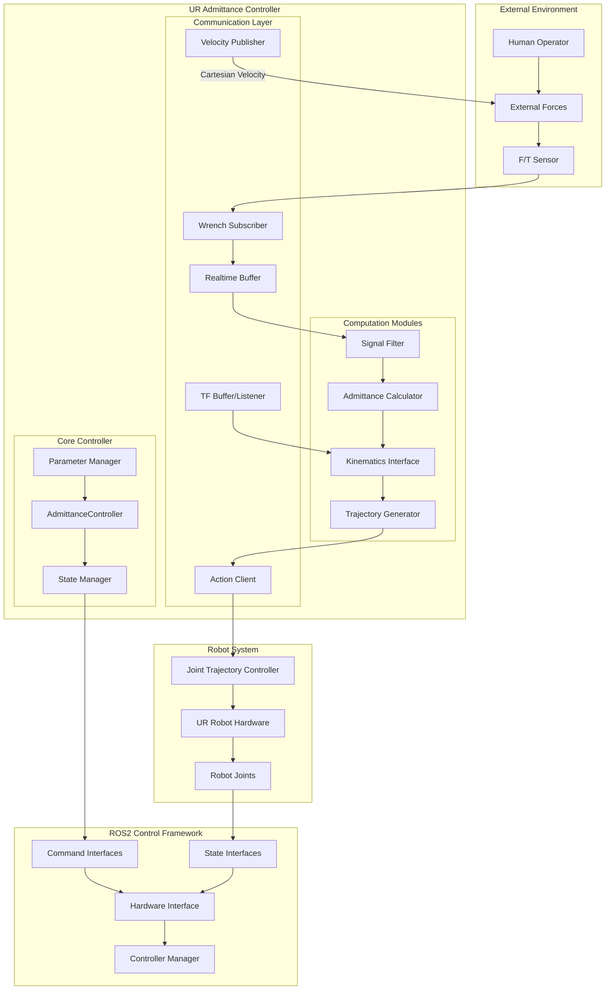

### Detailed Component Architecture
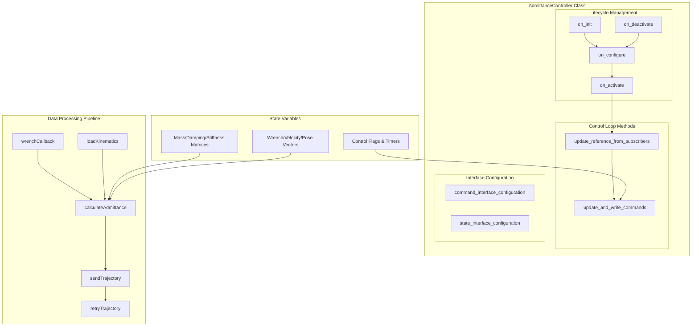

## Core Components

### Component Interaction Diagram
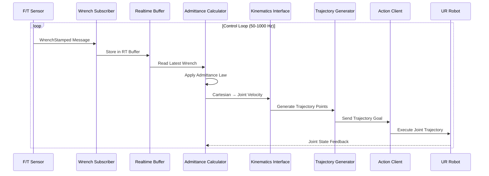

### 1. AdmittanceController Class
**File**: `admittance_controller.cpp/.hpp`

**Class Structure**:
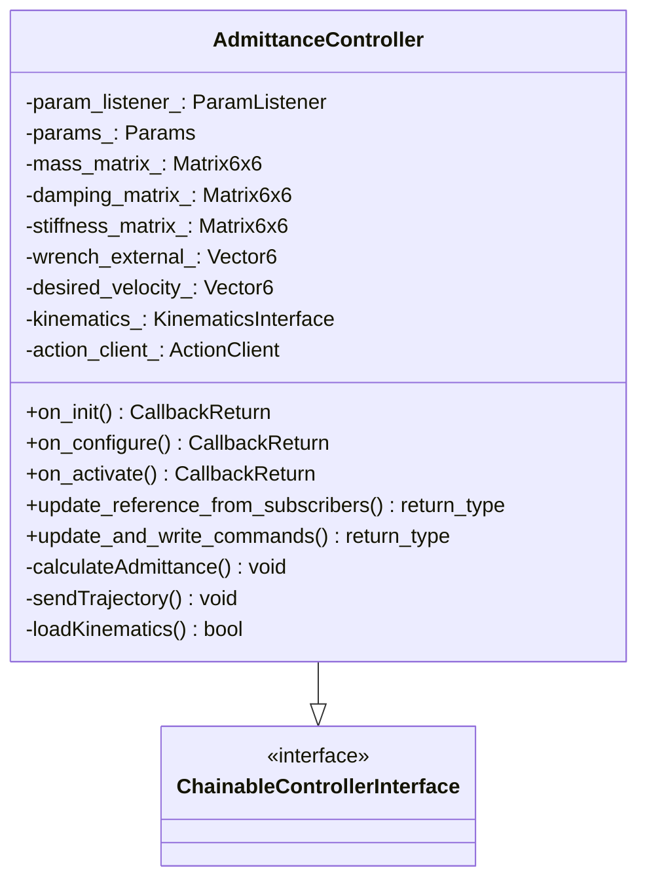

## Data Flow

### 1. Complete Data Flow Pipeline
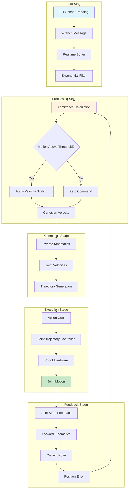

### 2. Signal Processing Flow
```mermaid
graph LR
    subgraph "Raw Input"
        A[Force X,Y,Z<br/>Torque X,Y,Z]
    end
    
    subgraph "Filtering"
        B[Exponential Filter<br/>α·new + (1-α)·old]
    end
    
    subgraph "Admittance Law"
        C[M⁻¹(F_ext - D·v - K·x)]
    end
    
    subgraph "Integration"
        D[v += a·dt]
    end
    
    subgraph "Conditioning"
        E[Deadband Filter<br/>Velocity Scaling<br/>Axis Masking]
    end
    
    subgraph "Output"
        F[Cartesian Velocity<br/>vx,vy,vz,ωx,ωy,ωz]
    end
    
    A --> B --> C --> D --> E --> F
```

### 3. Multi-Threading Data Flow
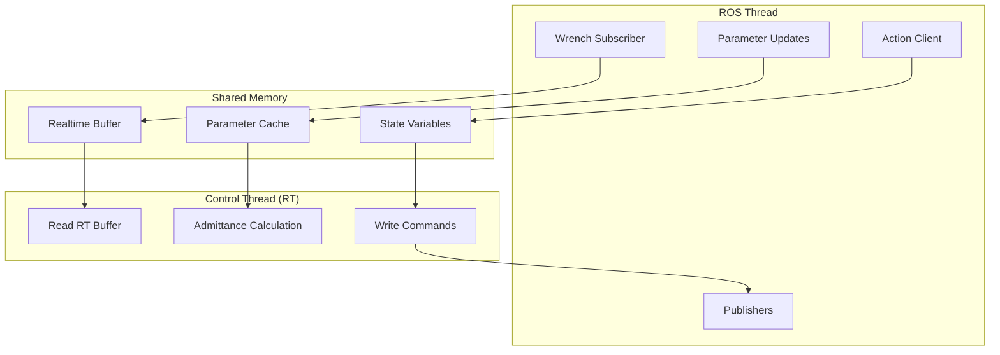

## Control Algorithm

### Admittance Control Algorithm Flow
```mermaid
flowchart TD
    A[Start Control Cycle] --> B[Read External Wrench]
    B --> C{Wrench Timeout?}
    C -->|Yes| D[Zero Wrench]
    C -->|No| E[Apply Filter]
    D --> F[Calculate Admittance]
    E --> F
    
    F --> G[Solve: a = M⁻¹(F_ext - D·v - K·x)]
    G --> H[Integrate: v += a·dt]
    H --> I[Apply Axis Enables]
    I --> J{|v| > threshold?}
    J -->|No| K[Zero Command]
    J -->|Yes| L[Scale Velocity]
    
    K --> M[Publish Velocity]
    L --> M
    M --> N[Generate Trajectory]
    N --> O[Send to Robot]
    O --> P[Wait Next Cycle]
    P --> A
    
    style A fill:#e8f5e8
    style O fill:#fff2cc
    style P fill:#f8cecc
```

### Matrix Computation Details
```mermaid
graph TB
    subgraph "Parameter Matrices (6x6)"
        A[Mass Matrix M<br/>diag[mx,my,mz,Ixx,Iyy,Izz]]
        B[Stiffness Matrix K<br/>diag[kx,ky,kz,krx,kry,krz]]
        C[Damping Matrix D<br/>D = 2ζ√(M·K)]
    end
    
    subgraph "State Vectors (6x1)"
        D[External Wrench<br/>[fx,fy,fz,τx,τy,τz]]
        E[Desired Velocity<br/>[vx,vy,vz,ωx,ωy,ωz]]
        F[Position Error<br/>[ex,ey,ez,θx,θy,θz]]
    end
    
    subgraph "Computation"
        G[Admittance Equation<br/>a = M⁻¹(F_ext - D·v - K·x)]
        H[Numerical Integration<br/>v += a·dt]
    end
    
    A --> G
    B --> G
    C --> G
    D --> G
    E --> G
    F --> G
    G --> H
    H --> E
```

### Control Loop Timing Diagram
```mermaid
gantt
    title Control Loop Timing (1ms cycle)
    dateFormat X
    axisFormat %L ms
    
    section Input Processing
    Read Sensors           :0, 100
    Filter Signals         :100, 150
    
    section Computation
    Admittance Calc        :150, 400
    Kinematics             :400, 600
    Trajectory Gen         :600, 750
    
    section Output
    Send Commands          :750, 850
    State Update           :850, 950
    
    section Overhead
    System Overhead        :950, 1000
```

## Interface Configuration

### Hardware Interface Mapping
```mermaid
graph TB
    subgraph "Command Interfaces"
        C1[shoulder_pan_joint/position]
        C2[shoulder_lift_joint/position]
        C3[elbow_joint/position]
        C4[wrist_1_joint/position]
        C5[wrist_2_joint/position]
        C6[wrist_3_joint/position]
        C7[shoulder_pan_joint/velocity]
        C8[shoulder_lift_joint/velocity]
        C9[elbow_joint/velocity]
        C10[wrist_1_joint/velocity]
        C11[wrist_2_joint/velocity]
        C12[wrist_3_joint/velocity]
    end
    
    subgraph "State Interfaces"
        S1[shoulder_pan_joint/position]
        S2[shoulder_lift_joint/position]
        S3[elbow_joint/position]
        S4[wrist_1_joint/position]
        S5[wrist_2_joint/position]
        S6[wrist_3_joint/position]
        S7[shoulder_pan_joint/velocity]
        S8[shoulder_lift_joint/velocity]
        S9[elbow_joint/velocity]
        S10[wrist_1_joint/velocity]
        S11[wrist_2_joint/velocity]
        S12[wrist_3_joint/velocity]
    end
    
    subgraph "F/T Sensor Interfaces"
        F1[ft_sensor/force.x]
        F2[ft_sensor/force.y]
        F3[ft_sensor/force.z]
        F4[ft_sensor/torque.x]
        F5[ft_sensor/torque.y]
        F6[ft_sensor/torque.z]
    end
    
    subgraph "Controller"
        CTRL[AdmittanceController]
    end
    
    C1 --> CTRL
    C2 --> CTRL
    C3 --> CTRL
    C4 --> CTRL
    C5 --> CTRL
    C6 --> CTRL
    C7 --> CTRL
    C8 --> CTRL
    C9 --> CTRL
    C10 --> CTRL
    C11 --> CTRL
    C12 --> CTRL
    
    CTRL --> S1
    CTRL --> S2
    CTRL --> S3
    CTRL --> S4
    CTRL --> S5
    CTRL --> S6
    CTRL --> S7
    CTRL --> S8
    CTRL --> S9
    CTRL --> S10
    CTRL --> S11
    CTRL --> S12
    
    CTRL --> F1
    CTRL --> F2
    CTRL --> F3
    CTRL --> F4
    CTRL --> F5
    CTRL --> F6
```

### Interface Configuration Flow
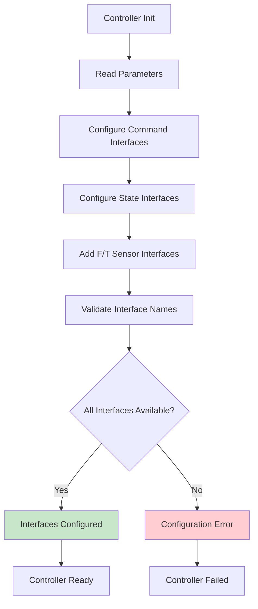

## State Management

### Controller Lifecycle State Machine
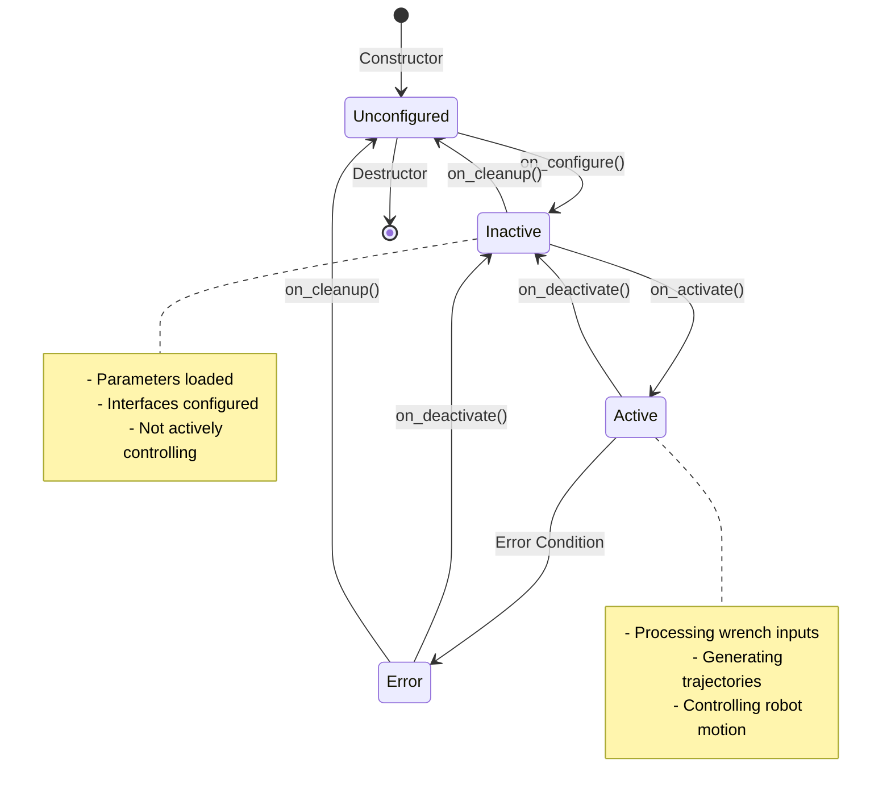

### Internal State Flow
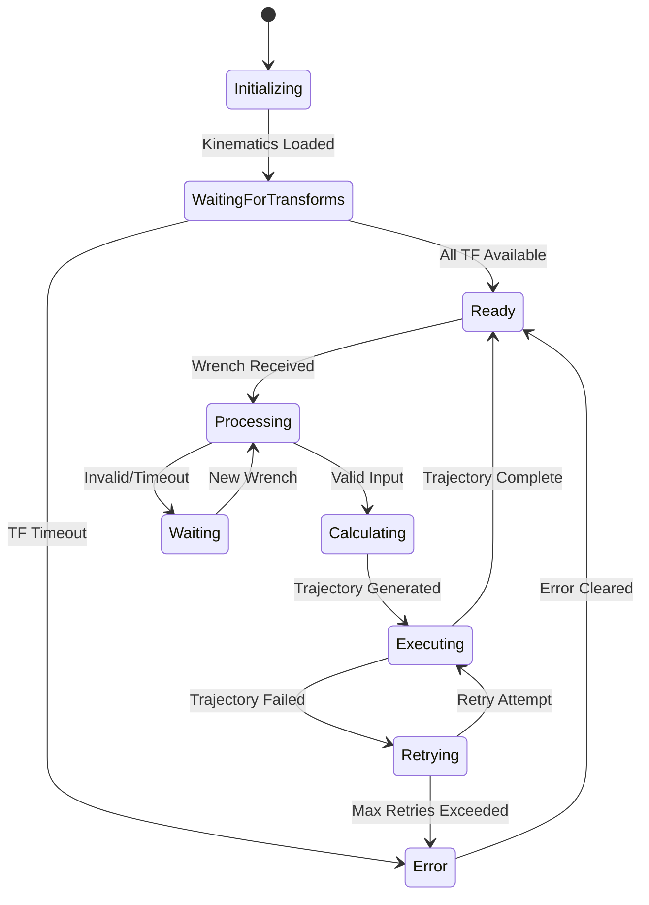

### Memory State Management
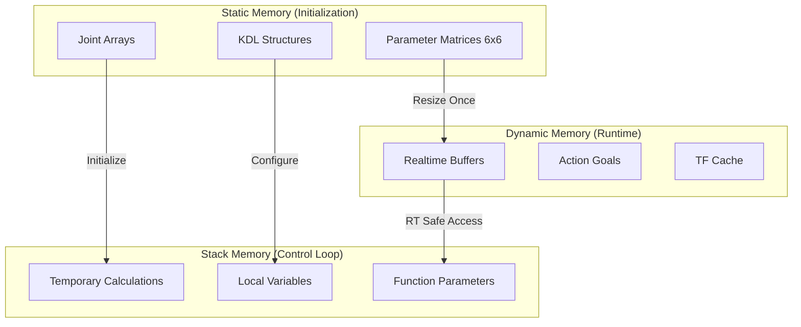

## Integration Points

### ROS2 Control Integration
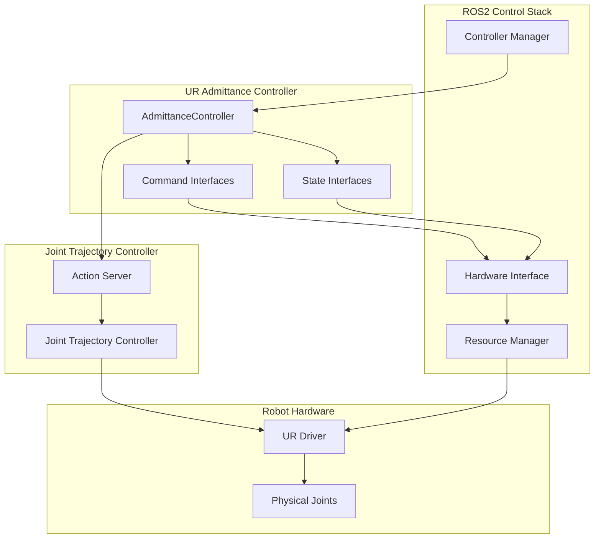

### Transform Integration (TF2)
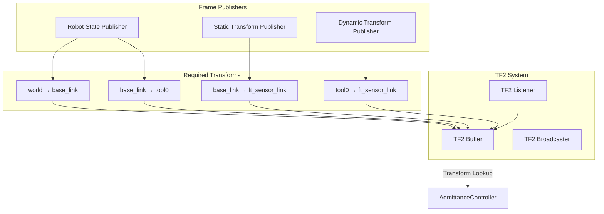

### Action Interface Integration
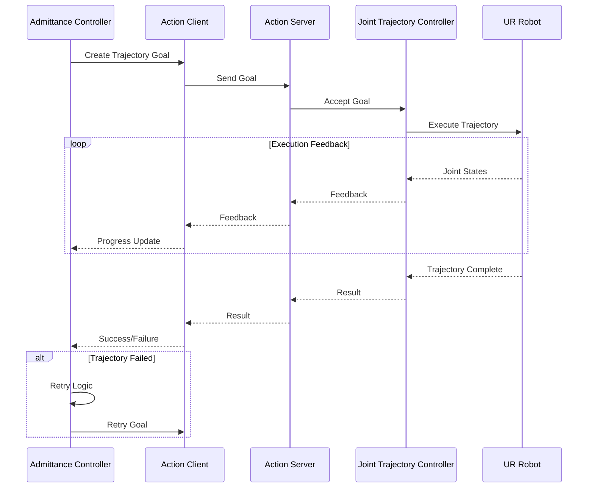

## Error Handling & Recovery

### Error Detection and Recovery Flow
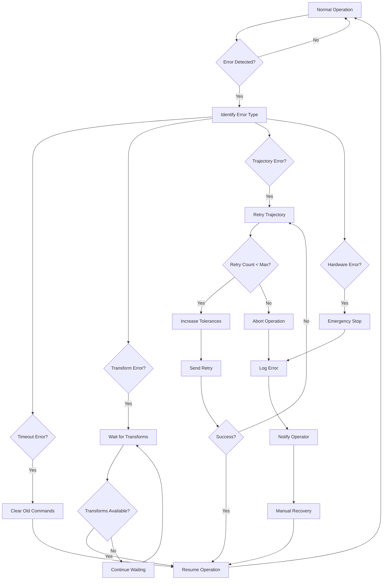

### Timeout Handling State Machine
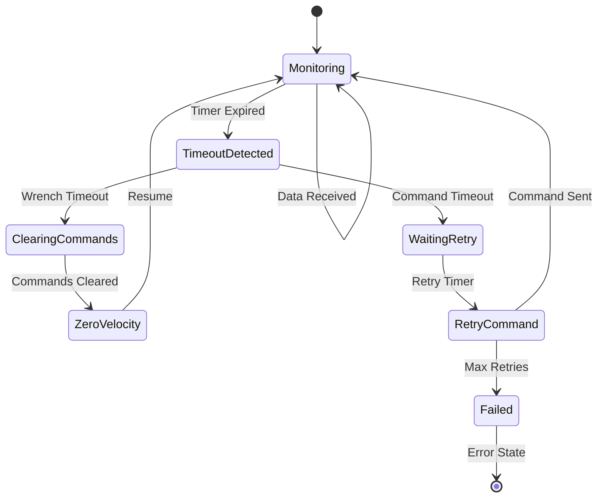

### Trajectory Retry Logic
```mermaid
graph TB
    A[Trajectory Failed] --> B[Increment Retry Count]
    B --> C{Retry Count < Max?}
    C -->|No| D[Log Error & Stop]
    C -->|Yes| E[Increase Tolerances]
    E --> F[Add Retry Delay]
    F --> G[Set Retry Timer]
    G --> H[Wait for Timer]
    H --> I[Resend Trajectory]
    I --> J{Success?}
    J -->|Yes| K[Reset Retry Count]
    J -->|No| A
    K --> L[Continue Operation]
    
    style D fill:#ffcdd2
    style K fill:#c8e6c9
```

## Configuration Parameters

### Parameter Hierarchy
```mermaid
graph TB
    subgraph "Admittance Parameters"
        A1[mass: [6] double]
        A2[stiffness: [6] double]
        A3[damping_ratio: [6] double]
        A4[admittance_enabled_axes: [6] bool]
    end
    
    subgraph "Control Parameters"
        B1[min_motion_threshold: double]
        B2[velocity_scale_factor: double]
        B3[filter_coefficient: double]
    end
    
    subgraph "Trajectory Parameters"
        C1[trajectory_duration: double]
        C2[position_tolerance: double]
        C3[velocity_tolerance: double]
        C4[goal_time_tolerance: double]
    end
    
    subgraph "Frame Parameters"
        D1[world_frame: string]
        D2[base_link: string]
        D3[tip_link: string]
        D4[ft_frame: string]
        D5[ft_sensor_name: string]
    end
    
    subgraph "Retry Parameters"
        E1[retry_on_abort: bool]
        E2[max_retries: int]
        E3[retry_delay: double]
    end
    
    subgraph "Joint Parameters"
        F1[joints: [6] string]
        F2[command_interfaces: [] string]
        F3[state_interfaces: [] string]
    end
```

### Parameter Validation Flow
```mermaid
flowchart TD
    A[Load Parameters] --> B{All Required Present?}
    B -->|No| C[Use Defaults]
    B -->|Yes| D[Validate Ranges]
    C --> D
    
    D --> E{Mass > 0?}
    E -->|No| F[Error: Invalid Mass]
    E -->|Yes| G{Damping Ratio > 0?}
    G -->|No| H[Error: Invalid Damping]
    G -->|Yes| I{Joints List Valid?}
    I -->|No| J[Error: Invalid Joints]
    I -->|Yes| K{Frames Exist?}
    K -->|No| L[Warning: Missing Frames]
    K -->|Yes| M[Parameters Valid]
    
    F --> N[Configuration Failed]
    H --> N
    J --> N
    L --> M
    M --> O[Continue Configuration]
    
    style F fill:#ffcdd2
    style H fill:#ffcdd2
    style J fill:#ffcdd2
    style M fill:#c8e6c9
```

## Operational Modes

### Mode Selection Logic
```mermaid
graph TB
    A[Controller Start] --> B{Chained Mode Parameter?}
    B -->|True| C[Initialize Chained Mode]
    B -->|False| D[Initialize Standalone Mode]
    B -->|Auto| E[Detect Mode from Interfaces]
    
    C --> F[Configure Command Interfaces]
    D --> G[Configure Action Client]
    E --> H{Other Controllers Present?}
    
    H -->|Yes| C
    H -->|No| D
    
    F --> I[Direct Command Writing]
    G --> J[Action-based Control]
    
    I --> K[Chained Operation]
    J --> L[Standalone Operation]
```

### Standalone Mode Operation
```mermaid
sequenceDiagram
    participant Input as Force Input
    participant AC as Admittance Controller
    participant Action as Action Client
    participant JTC as Joint Trajectory Controller
    participant Robot as UR Robot
    
    loop Control Loop
        Input->>AC: Wrench Data
        AC->>AC: Calculate Admittance
        AC->>AC: Generate Trajectory
        AC->>Action: Send Trajectory Goal
        Action->>JTC: Forward Goal
        JTC->>Robot: Execute Motion
        Robot-->>AC: Joint State Feedback
    end
```

### Chained Mode Operation
```mermaid
sequenceDiagram
    participant Input as Force Input
    participant AC as Admittance Controller
    participant CI as Command Interface
    participant NextCtrl as Next Controller
    participant Robot as UR Robot
    
    loop Control Loop
        Input->>AC: Wrench Data
        AC->>AC: Calculate Admittance
        AC->>AC: Compute Joint Commands
        AC->>CI: Write Joint Commands
        CI->>NextCtrl: Forward Commands
        NextCtrl->>Robot: Execute Motion
        Robot-->>AC: Joint State Feedback
    end
```

### Mode Comparison
```mermaid
graph TB
    subgraph "Standalone Mode"
        S1[Direct Action Communication]
        S2[Simple Integration]
        S3[Independent Operation]
        S4[Trajectory-based Control]
    end
    
    subgraph "Chained Mode"
        C1[Interface-based Communication]
        C2[Complex Integration]
        C3[Coordinated Operation]
        C4[Real-time Command Control]
    end
    
    subgraph "Common Features"
        CF1[Admittance Calculation]
        CF2[Safety Monitoring]
        CF3[Parameter Management]
        CF4[Error Handling]
    end
    
    S1 --> CF1
    S2 --> CF2
    S3 --> CF3
    S4 --> CF4
    
    C1 --> CF1
    C2 --> CF2
    C3 --> CF3
    C4 --> CF4
```

---

## Implementation Notes

### Real-time Considerations
- Uses `realtime_tools::RealtimeBuffer` for thread-safe communication
- Avoids dynamic memory allocation in control loops
- Minimizes computational complexity in time-critical paths

### Thread Safety Architecture
```mermaid
graph TB
    subgraph "ROS Communication Thread"
        RT1[Subscriber Callbacks]
        RT2[Parameter Updates]
        RT3[Action Client Callbacks]
        RT4[Publisher Operations]
    end
    
    subgraph "Real-time Control Thread"
        CT1[State Interface Reading]
        CT2[Admittance Calculations]
        CT3[Command Interface Writing]
    end
    
    subgraph "Thread-safe Data Structures"
        TS1[RealtimeBuffer<WrenchStamped>]
        TS2[Atomic Parameter Cache]
        TS3[Lock-free State Variables]
    end
    
    RT1 --> TS1
    RT2 --> TS2
    RT3 --> TS3
    RT4 --> TS3
    
    TS1 --> CT1
    TS2 --> CT2
    TS3 --> CT3
```

### Performance Optimization Flow
```mermaid
graph LR
    A[Input Processing<br/>~10μs] --> B[Matrix Operations<br/>~50μs]
    B --> C[Kinematics<br/>~100μs]
    C --> D[Trajectory Gen<br/>~30μs]
    D --> E[Output Writing<br/>~10μs]
    E --> F[Total: ~200μs<br/>for 1kHz control]
    
    style A fill:#e3f2fd
    style B fill:#fff3e0
    style C fill:#fce4ec
    style D fill:#f1f8e9
    style E fill:#fafafa
    style F fill:#c8e6c9
```

### Future Enhancement Roadmap
```mermaid
graph TB
    A[Current Implementation] --> B[Phase 1: Core Improvements]
    B --> C[Phase 2: Advanced Features]
    C --> D[Phase 3: AI Integration]
    
    subgraph "Phase 1"
        B1[Complete Kinematics Integration]
        B2[Advanced Trajectory Optimization]
        B3[Enhanced Safety Monitoring]
    end
    
    subgraph "Phase 2"
        C1[Adaptive Parameter Tuning]
        C2[Multi-sensor Fusion]
        C3[Predictive Control]
    end
    
    subgraph "Phase 3"
        D1[Machine Learning Integration]
        D2[Intelligent Fault Detection]
        D3[Autonomous Parameter Optimization]
    end
    
    B --> B1
    B --> B2
    B --> B3
    
    C --> C1
    C --> C2
    C --> C3
    
    D --> D1
    D --> D2
    D --> D3
```

This comprehensive architecture document provides multiple detailed diagrams to illustrate every aspect of the UR Admittance Controller, making it much clearer and easier to understand for developers, integrators, and users at all levels.